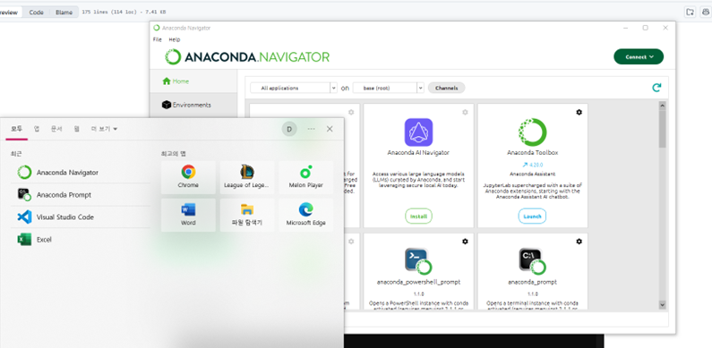
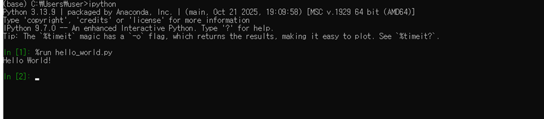
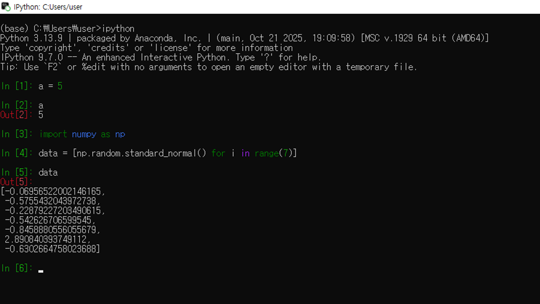
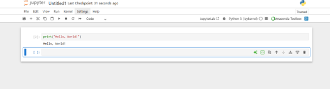
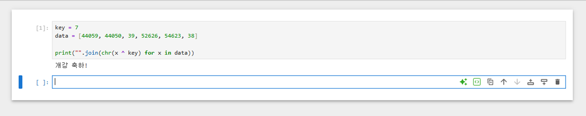

# Python 1주차 정규 과제 

📌Python 정규과제는 매주 정해진 분량의 『*파이썬 라이브러리를 활용한 데이터 분석*』 을 읽고 학습하는 것입니다. 이번주는 아래의 **Python_1st_TIL**에 나열된 분량을 읽고 공부하시면 됩니다.

아래의 문제를 풀어보며 학습 내용을 점검하세요. 문제를 해결하는 과정에서 개념을 스스로 정리하고, 필요한 경우 참고 자료를 통해 보완하는 것이 좋습니다.

**교재 실습 예제 파일은 07_Python_Template 레포지토리의 notebooks 폴더에 업로드되어 있습니다.**

**👀(수행 인증샷은 필수입니다.)** 

## Python_1st_TIL

### 1장 시작하기 전에
#### 1. 다루는 내용
#### 2. 데이터 분석에 파이썬을 사용하는 이유
#### 3. 필수 파이썬 라이브러리
#### 4. 설치 및 설정
#### 5. 커뮤니티와 콘퍼런스
#### 6. 이 책을 살펴보는 방법
### 2장 파이썬 기초, IPython과 주피터 노트북 
#### 1. 파이썬 인터프리터 
#### 2. IPython 기초 
#### 3. 파이썬 기초
#### 4. 마치며


## Study Schedule

| 주차  | 공부 범위     | 완료 여부 |
| ----- | ------------- | --------- |
| 1주차 | p.25~82    | ✅         |
| 2주차 | p.83~129   | 🍽️         |
| 3주차 | p.131~179  | 🍽️         |
| 4주차 | p.181~246 | 🍽️         |
| 5주차 | p.247~309 | 🍽️         |
| 6주차 | p.310~379 | 🍽️         |
| 7주차 | p.381~465 | 🍽️         |


<br>

<!-- 여기까진 그대로 둬 주세요-->

---

# 1️⃣ 학습 내용 정리

## 1. 설치 및 설정 

```
아나콘다(Anaconda) 또는 미니콘다(Miniconda)를 설치한 후, 필수 패키지를 설치하고 설치 완료 화면을 캡처하여 제출해주세요.
```



## 2. 파이썬 인터프리터 

```
간단한 hello_world.py 파일을 생성한 후, Anaconda Prompt(또는 Miniconda Prompt)를 실행하세요.
(해당 파일에는 print('Hello World!')라고 입력해주세요.)
프롬프트에서 ipython을 입력하여 IPython 환경을 실행한 뒤, %run hello_world.py 명령어로 파일을 실행하시기 바랍니다.
실행 결과가 나타난 화면을 캡처하여 제출해주세요.
```




## 3. IPython 기초  

### IPython 셀 실행하기 
```
IPython을 실행한 후, 아래 코드를 한 줄씩 입력하여 실행해보세요. 각 명령어 실행 결과를 확인하고, 실행 화면을 캡처하여 제출해주세요.
```
```python
a = 5
a

import numpy as np
data = [np.random.standard_normal() for i in range(7)]
data
```



### 주피터 노트북 실행하기 

```
주피터 노트북을 실행한 후, 새로운 노트북을 생성하세요.
코드 셀에 print("Hello, World!")를 입력하고 실행한 뒤, 출력 결과가 나타난 화면을 캡처하여 제출해주세요.
```




## 파이썬 기초  

- 데이터 분석에서 가장 많은 시간을 차지하는 작업은 분석 자체보다 데이터를 정리하고 가공하는 과정이라는 점이 흥미로웠음

- NumPy는 빠른 수치 계산을 위한 다차원 배열 기반 라이브러리

- pandas는 표 형태의 데이터를 효율적으로 다룰 수 있는 데이터 분석 핵심 라이브러리

- IPython은 일반 파이썬 인터프리터보다 더 편리한 대화형 실행 환경이라는 특징이 있음

- IPython에서는 In [ ] 형태로 명령어 실행 기록이 번호로 표시된다는 특징이 있음

- IPython에서는 %run 명령어를 사용해 파이썬 파일을 직접 실행할 수 있음

- Jupyter Notebook은 코드와 설명, 결과를 하나의 문서 형태로 함께 작성할 수 있는 데이터 분석 환경임

- IPython에서는 Tab 키를 이용해 변수나 함수 이름을 자동 완성할 수 있어 코드를 더 빠르게 작성할 수 있음


---

# 2️⃣ 실습 과제

**주피터 노트북에서 아래의 코드 셀을 실행하고, 출력 결과를 캡처하여 제출하세요.**

```python
key = 7
data = [44059, 44050, 39, 52626, 54623, 38]

print("".join(chr(x ^ key) for x in data))
```



### 🎉 수고하셨습니다.


